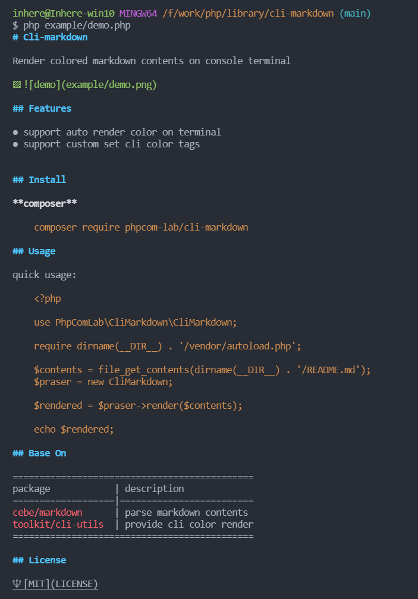

# CLI-Markdown

[](LICENSE)
[](https://packagist.org/packages/phppkg/cli-markdown)
[](https://github.com/phppkg/cli-markdown)
[](https://github.com/phppkg/cli-markdown/actions)

Render colored markdown contents on console terminal

**Preview**

> run demo by `php example/demo.php`



## Features

- support auto render color on terminal
- support custom set cli color tags

## Install

**composer**

```bash
composer require phppkg/cli-markdown
```

## Usage

quick usage:

```php
<?php

use PhpPkg\CliMarkdown\CliMarkdown;

require dirname(__DIR__) . '/vendor/autoload.php';

$contents = file_get_contents(dirname(__DIR__) . '/README.md');
$praser = new CliMarkdown;

$rendered = $praser->render($contents);

echo $rendered;
```

## Base on

package | description
---------|--------------
`cebe/markdown` | parse markdown contents
`toolkit/cli-utils` | provide cli color render

## License

[MIT](LICENSE)
